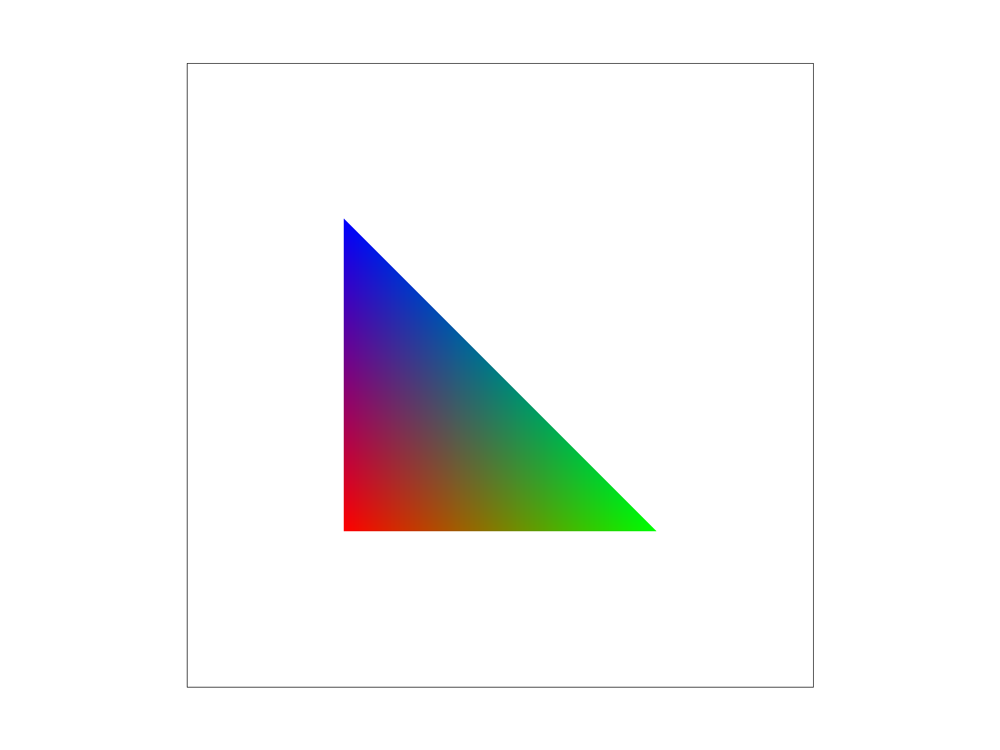
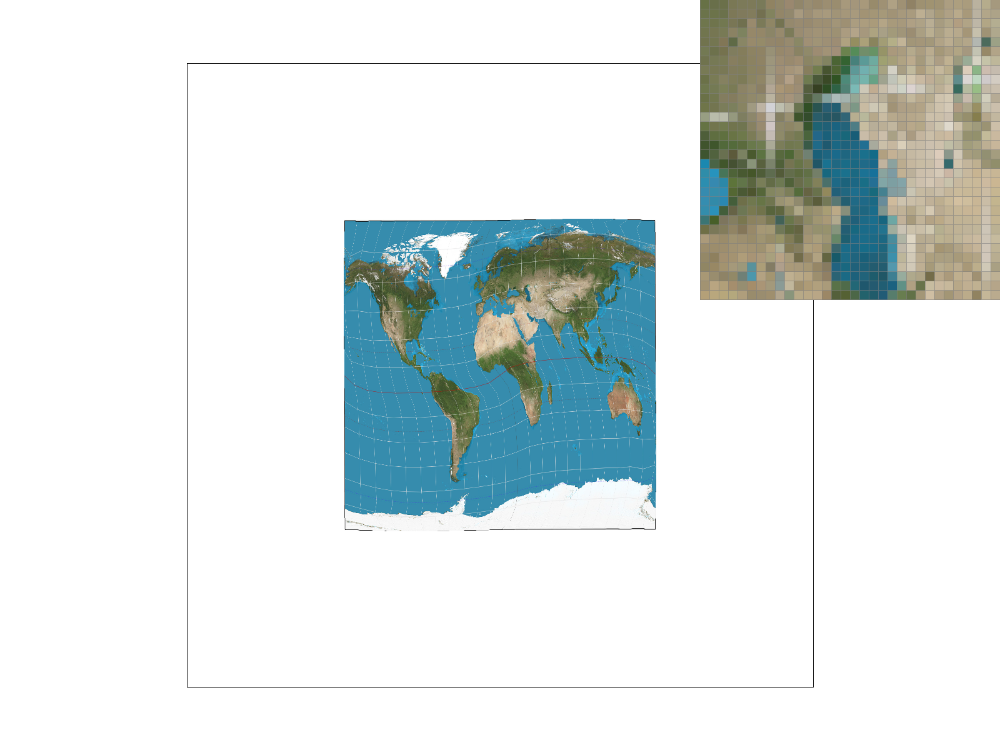

> [Link to markdown webpage](https://github.com/ZaychikLiu/CS184_HW1_written_up/blob/main/HW1_webpage.md)

# Task1

## Q1:

> Describtion of algorithm

we set up a bounding box to include the pixels in the loop. And we compute the central of each pixel.For each pixel, it calculates three edge functions, one for each edge of the triangle, to determine on which side of the edge the pixel center lies. Thus the pixel within the triangle will be colored.

## Q2

> Efficiency Explaination

This approach is efficient because it limits the computation to the pixels within the bounding box, meaning it only performs the necessary tests for potentially affected pixels. In our judgement of three edge function, the computation cost  is similar to directly performing computation of origin method that checks every pixels in the triangle.

> Code

```c++
void RasterizerImp::rasterize_triangle(float x0, float y0,
                                       float x1, float y1,
                                       float x2, float y2,
                                       Color color) {
    float min_X = min(min(x0, x1), x2);
    float max_X = max(max(x0, x1), x2);
    float min_Y = min(min(y0, y1), y2);
    float max_Y = max(max(y0, y1), y2);

    float area = (x1 - x0) * (y2 - y0) - (x2 - x0) * (y1 - y0);
    if (area == 0) return;
    float sign = (area > 0) ? 1.0f : -1.0f;
    for (int x = floor(min_X); x <= floor(max_X); ++x) {
        for (int y = floor(min_Y); y <= floor(max_Y); ++y) {

            float px = x + 0.5f;
            float py = y + 0.5f;

            float dx0 = x1 - x0;
            float dy0 = y1 - y0;
            float L0 = -(px - x0) * dy0 + (py - y0) * dx0;

            float dx1 = x2 - x1;
            float dy1 = y2 - y1;
            float L1 = -(px - x1) * dy1 + (py - y1) * dx1;

            float dx2 = x0 - x2;
            float dy2 = y0 - y2;
            float L2 = -(px - x2) * dy2 + (py - y2) * dx2;

            // Check if the point is inside the triangle
            if (L0*sign >= 0 && L1*sign >= 0 && L2*sign >= 0) {
                fill_pixel(x, y, color);
            }
        }
    }
}
```

## Result


# Task 2

> Antialiasing by Supersampling

## supersampling algorithm

Started from Task1,I add supersamping into triangle rasterization. The supersampling can divide a pixel into smaller one for computation. So we can get a detailed photo with fewer jagged edges,More accurate color blending,and more smooth image results.we implemented inner loop for every pixel division and provide sample buffer for pixel color filling.

## modification

We utilize a simpler judgement of triangle for pixel color filling. Then I added two inner(x-ordinate and y-ordinate) of  iterations to provide supersampling in filling color of our loop.

```c++
inline bool in_triangle(float x, float y,
                        float x0, float y0,
                        float x1, float y1,
                        float x2, float y2) {
    // A simple inside-test using barycentric or cross-product approach
    // (There are many ways; pick one you prefer.)

    // Vector cross-product approach:
    float denom = (y1 - y2) * (x0 - x2) + (x2 - x1) * (y0 - y2);
    float L0 = ((y1 - y2) * (x - x2) + (x2 - x1) * (y - y2)) / denom;
    float L1 = ((y2 - y0) * (x - x2) + (x0 - x2) * (y - y2)) / denom;
    float L2 = 1.f - L0 - L1;

    return L0 >= 0 && L1 >= 0 && L2 >= 0 && L0 <= 1 && L1 <= 1 && L2 <= 1;
}

void RasterizerImp::rasterize_triangle(float x0, float y0,
                                       float x1, float y1,
                                       float x2, float y2,
                                       Color color) {
    
    // TODO: Task 2: Update to implement super-sampled rasterization
    float min_x = floorf(min(min(x0, x1), x2));
    float max_x = floorf(max(max(x0, x1), x2));
    float min_y = floorf(min(min(y0, y1), y2));
    float max_y = floorf(max(max(y0, y1), y2));

    int sqrt_sample = (int) floor(sqrt((float) sample_rate));

    for (int px = (int) min_x; px <= (int) max_x; px++) {
        for (int py = (int) min_y; py <= (int) max_y; py++) {
            if (px < 0 || px >= (int) width) continue;
            if (py < 0 || py >= (int) height) continue;

            for (int sample_x = 0; sample_x < sqrt_sample; sample_x++) {
                for (int sample_y = 0; sample_y < sqrt_sample; sample_y++) {
                    float fx = (float) px + ((float) sample_x + 0.5f) / (float) sqrt_sample;
                    float fy = (float) py + ((float) sample_y + 0.5f) / (float) sqrt_sample;

                    if (in_triangle(fx, fy, x0, y0, x1, y1, x2, y2)) {
                        int sample_id = sample_y * sqrt_sample + sample_x;
                        int index = (py * width + px) * sample_rate + sample_id;
                        sample_buffer[index] = color;
                    }
                }
            }
        }
    }
}
```

## we added sample buffer related to sample rate expandsion for fill pixel

```c++
void RasterizerImp::fill_pixel(size_t x, size_t y, Color c) {
    // TODO: Task 2: You might need to this function to fix points and lines (such as the black rectangle border in test4.svg)
    // NOTE: You are not required to implement proper supersampling for points and lines
    // It is sufficient to use the same color for all supersamples of a pixel for points and lines (not triangles)

    if (x >= width || y >= height) return;

    // For points and lines, fill *all* subsamples of this pixel with the same color
    for (int s = 0; s < sample_rate; s++) {
        sample_buffer[(y * width + x) * sample_rate + s] = c;
    }
}
```

## these functions remain the same

```c++
void RasterizerImp::set_sample_rate(unsigned int rate) {
    // TODO: Task 2: You may want to update this function for supersampling support
    this->sample_rate = rate;
    this->sample_buffer.resize(width * height * sample_rate, Color::White);
}


void RasterizerImp::set_framebuffer_target(unsigned char *rgb_framebuffer,
                                           size_t width, size_t height) {
    // TODO: Task 2: You may want to update this function for supersampling support

    this->width = width;
    this->height = height;
    this->rgb_framebuffer_target = rgb_framebuffer;
    this->sample_buffer.resize(width * height * sample_rate, Color::White);
}
```

> supersampling result 


## Explaination of outcome:

In sumpersampling of 1,4,16, we get more-detailed and fewer jagged edges. Due to higher supersampling rate, the pixels have been divided more times to get more block for color filling. we implement more detailed color filling,  so the picture will be skinnyin supersamping 16 than 1.

# Task 3

> Transforms

## function translate

the translate function is a matrix transform by shifting an point by (dx,dy) from the origin  


## function scale

the translate function is a matrix transform by expanding an point by (sx,sy) times from the origin


## function rotate

he translate function is a matrix transform by rotaing an point following the origin by given rads 


> Code

```c++
Matrix3x3 translate(float dx, float dy) {
	// Part 3: Fill this in.
	return Matrix3x3(1, 0, dx, 0, 1, dy, 0, 0, 1);

	
}

Matrix3x3 scale(float sx, float sy) {
	// Part 3: Fill this in.
	return Matrix3x3(sx, 0, 0, 0, sy, 0, 0, 0, 1);

	
}

// The input argument is in degrees counterclockwise
Matrix3x3 rotate(float deg) {
	// Part 3: Fill this in.
	double rads = deg * M_PI / 180.0f;
	return Matrix3x3(cos(rads), -sin(rads), 0, sin(rads), cos(rads), 0, 0, 0, 1);
}
```

> Transformation result


In the picture the robot seemed to be out of power in its head and body, so the robot head rotated and its body and head became blue.

# Task 4

### Q1:

> Explain barycentric coordinates in your own words and use an image to aid you in your explanation. One idea is to use a *svg* file that plots a single triangle with one red, one green, and one blue vertex, which should produce a smoothly blended color triangle.

Barycentric coordinates are a way of expressing the position or the value of a point inside a triangle using the triangle’s three vertices by describing the point as a weighted combination of the three triangle vertices.


Imagine you have a triangle with three vertices:

$$
A(x_1, y_1)
$$

$$
B(x_2, y_2)
$$

$$
C(x_3, y_3)
$$

Any point $$ P(x, y) $$ **inside (or outside) the triangle** can be written as:

$$
P = \lambda_1 A + \lambda_2 B + \lambda_3 C
$$

where:

- $$ \lambda_1, \lambda_2, \lambda_3 $$ are the barycentric coordinates.
- These are weights that tell us how much influence each vertex has on the point $$ P $$.
- The sum of the weights always equals **1**:

$$
\lambda_1 + \lambda_2 + \lambda_3 = 1
$$

We can think of it this way: if a point $x$ is closer to vertex $v$, then v accounts for a larger proportion of the final value of $x$.

As shown in this picture, I use three vertex, one is red(down), one is green(right), one is blue(up), for the point(inside the triangle) is closing to the blue vetexs, its color would be much more closer to blue. The same as the point near the green and red point



For example.

- If $$ P $$ is **exactly at vertex** $$ A $$ → then $$ \lambda_1 = 1 $$, and $$ \lambda_2 = \lambda_3 = 0 $$.
- If $$ P $$ is **exactly at vertex** $$ B $$ → then $$ \lambda_2 = 1 $$, and $$ \lambda_1 = \lambda_3 = 0 $$.
- If $$ P $$ is **exactly at vertex** $$ C $$ → then $$ \lambda_3 = 1 $$, and $$ \lambda_1 = \lambda_2 = 0 $$.

Then we get

Actually, the portation is calculated by the proportional distances--here we should use distance the the opposite side.


The formulation is calculated below:


Using Similarity Relationships


Therefore, the final formulation is below


* code
  * `RasterizerImp::rasterize_interpolated_color_triangle(...)`

```c++
void RasterizerImp::rasterize_interpolated_color_triangle(float x0, float y0, Color c0,
                                                              float x1, float y1, Color c1,
                                                              float x2, float y2, Color c2) {
        // TODO: Task 4: Rasterize the triangle, calculating barycentric coordinates and using them to interpolate vertex colors across the triangle
        // Hint: You can reuse code from rasterize_triangle
        double minX = min(min(x0, x1), x2);
        double maxX = max(max(x0, x1), x2);
        double minY = min(min(y0, y1), y2);
        double maxY = max(max(y0, y1), y2);

        float d = (y1 - y2) * (x0 - x2) + (x2 - x1) * (y0 - y2);
        for (int x = floor(minX); x <= floor(maxX); ++x) {
            for (int y = floor(minY); y <= floor(maxY); ++y) {
                // Calculate the center of the pixel
                double px = x + 0.5f;
                double py = y + 0.5f;

                // Perform the point-in-triangle test
                double alpha = ((y1 - y2) * (px - x2) + (x2 - x1) * (py - y2)) / d;
                double beta = ((y2 - y0) * (px - x2) + (x0 - x2) * (py - y2)) / d;
                double gamma = 1.0f - alpha - beta;

                // Check if the point is inside the triangle
                if (alpha >= 0 && beta >= 0 && gamma >= 0) {
                    double alpha_color = (-(px - x1) * (y2 - y1) + (py - y1) * (x2 - x1)) / (
                                             -(x0 - x1) * (y2 - y1) + (y0 - y1) * (x2 - x1));
                    double beta_color = (-(px - x2) * (y0 - y2) + (py - y2) * (x0 - x2)) / (
                                            -(x1 - x2) * (y0 - y2) + (y1 - y2) * (x0 - x2));
                    double gamma_color = 1.0f - alpha_color - beta_color;
                    Color interpolated_color = alpha_color * c0 + beta_color * c1 + gamma_color * c2;
                    fill_pixel(x, y, interpolated_color);
                }
            }
        }
    }
```


## Q2

> Show a *png* screenshot of *svg/basic/test7.svg* with default viewing parameters and sample rate 1. If you make any additional images with color gradients, include them.


# Task 5

## Q1

> Explain pixel sampling in your own words and describe how you implemented it to perform texture mapping. Briefly discuss the two different pixel sampling methods, nearest and bilinear.


### Sampling

Sampling refers to the process of selecting a subset of pixels from an image to represent the entire image at a lower resolution, or we can say the we want to use less data to approximate the original data. This process is often used to reduce the amount of data that needs to be processed or stored. And pixel sampling, as an analogy, it is to use as few pixels as possible to represent the original image as closely as possible.

### Inplementation

My inplementation is below(emmm, I would like to include task 6):

* Convert screen space (x, y) to texture coordinates (u, v)
  * The rasterize_textured_triangle function calculates barycentric coordinates for each pixel inside the triangle.
  * These barycentric coordinates are then used to interpolate the (u, v) texture coordinates.
* Compute texture differentials for mipmapping(task 6)
  * The function computes small changes in texture coordinates (p_dx_uv and p_dy_uv).
  * These are used to select the appropriate mipmap level if mipmapping is enabled.
* Choose a pixel sampling method
  * Choose the Nearest-neighbor sampling or the Bilinear interpolation sampling
* Finally, fetch the sampled texture color
  * Calls tex.sample(sp), which internally selects sample_nearest or sample_bilinear based on psm (Pixel Sampling Mode).
  * The final color is then stored in the sample buffer.

> Code

* `RasterizerImp::rasterize_textured_triangle`

  * ```c++
    void RasterizerImp::rasterize_textured_triangle(float x0, float y0, float u0, float v0,
                                                        float x1, float y1, float u1, float v1,
                                                        float x2, float y2, float u2, float v2,
                                                        Texture &tex) {
            // TODO: Task 5: Fill in the SampleParams struct and pass it to the tex.sample function.
            double minX = min(min(x0, x1), x2);
            double maxX = max(max(x0, x1), x2);
            double minY = min(min(y0, y1), y2);
            double maxY = max(max(y0, y1), y2);
    
            float d = (y1 - y2) * (x0 - x2) + (x2 - x1) * (y0 - y2);
            int sqrt_sample = (int)floor(sqrt((float)sample_rate));
    
            SampleParams sp;
            sp.lsm = this->lsm;
            sp.psm = this->psm;
    
            for (int x = floor(minX); x <= floor(maxX); ++x) {
                for (int y = floor(minY); y <= floor(maxY); ++y) {
                    
                        for (int sample_x = 0; sample_x < sqrt_sample; sample_x++) {
                            for (int sample_y = 0; sample_y < sqrt_sample; sample_y++) {
                                // Calculate the center of the pixel
                                double px = x + (0.5f+sample_x)/sqrt_sample;
                                double py = y + (0.5f+sample_y)/sqrt_sample;
                                float inv_sample_rate = 1.0f / sqrt_sample;
                                //float sample_x = px + (i + 0.5f) * inv_sample_rate;
                                //float sample_y = py + (j + 0.5f) * inv_sample_rate;
                                // Perform the point-in-triangle test
                                double alpha = ((y1 - y2) * (px - x2) + (x2 - x1) * (py - y2)) / d;
                                double beta = ((y2 - y0) * (px - x2) + (x0 - x2) * (py - y2)) / d;
                                double gamma = 1.0f - alpha - beta;
    
                                if (alpha >= 0 && beta >= 0 && gamma >= 0) {
                                    //?????
                                    float u = alpha * u0 + beta * u1 + gamma * u2;
                                    float v = alpha * v0 + beta * v1 + gamma * v2;
                                    sp.p_uv = Vector2D(u, v);
    
                                    float alpha_dx = ((y1 - y2) * (px + 1 - x2) + (x2 - x1) * (py - y2)) / d;
                                    float beta_dx = ((y2 - y0) * (px + 1 - x2) + (x0 - x2) * (py - y2)) / d;
                                    float gamma_dx = 1.0f - alpha_dx - beta_dx;
                                    float u_dx = alpha_dx * u0 + beta_dx * u1 + gamma_dx * u2;
                                    float v_dx = alpha_dx * v0 + beta_dx * v1 + gamma_dx * v2;
                                    sp.p_dx_uv = Vector2D(u_dx, v_dx);
    
                                    float alpha_dy = ((y1 - y2) * (px - x2) + (x2 - x1) * (py + 1 - y2)) / d;
                                    float beta_dy = ((y2 - y0) * (px - x2) + (x0 - x2) * (py + 1 - y2)) / d;
                                    float gamma_dy = 1.0f - alpha_dy - beta_dy;
                                    float u_dy = alpha_dy * u0 + beta_dy * u1 + gamma_dy * u2;
                                    float v_dy = alpha_dy * v0 + beta_dy * v1 + gamma_dy * v2;
                                    sp.p_dy_uv = Vector2D(u_dy, v_dy);
    
                                    Color sampled_color;
                                    sampled_color = tex.sample(sp);
                                        
                                    int sample_id = sample_y * sqrt_sample + sample_x;
                                    int index = (y * width + x) * sample_rate + sample_id;
                                    sample_buffer[index] = sampled_color;
                                
                            }
                        }
                    }
                }
            }
            // TODO: Task 6: Set the correct barycentric differentials in the SampleParams struct.
            // Hint: You can reuse code from rasterize_triangle/rasterize_interpolated_color_triangle
        }
    ```

* `Texture::sample_nearest`

  * ```c++
    Color Texture::sample_nearest(Vector2D uv, int level) {
            // TODO: Task 5: Fill this in.
            auto &mip = mipmap[level];
            double tx = uv.x * (mip.width - 1);
            double ty = uv.y * (mip.height - 1);
            Color texture = mip.get_texel(lround(tx), lround(ty));
            return texture;
    
            // return magenta for invalid level
            return Color(1, 0, 1);
        }
    ```

* `Texture::sample_bilinear`

  * ```c++
    Color Texture::sample_bilinear(Vector2D uv, int level) {
            // TODO: Task 5: Fill this in.
            auto &mip = mipmap[level];
            float tx = uv.x * (mip.width - 1);
            float ty = uv.y * (mip.height - 1);
    
            // int midx = lround(tx);
            // int midy = lround(ty);
    
            int u00x = floor(tx);
            int u00y = floor(ty);
    
            int u01x = floor(tx);
            int u01y = ceil(ty);
    
            int u10x = ceil(tx);
            int u10y = floor(ty);
    
            int u11x = ceil(tx);
            int u11y = ceil(ty);
    
            Color c00 = mip.get_texel(u00x, u00y);
            Color c01 = mip.get_texel(u01x, u01y);
            Color c10 = mip.get_texel(u10x, u10y);
            Color c11 = mip.get_texel(u11x, u11y);
    
            float s = tx - u00x;
            float t = ty - u00y;
    
            Color u0 = (1 - s) * c00 + s * c10;
            Color u1 = (1 - s) * c01 + s * c11;
            Color final = (1 - t) * u0 + t * u1;
    
            return final;
    
            // return magenta for invalid level
            return Color(1, 0, 1);
        }
    ```

### Difference

#### nearest

Sample_nearest selects the closest(lround) texel to the given UV coordinate using integer rounding, making it the fastest but also the most prone to blocky and jagged textures due to aliasing, which is useful for pixel-art or retro-style graphics. 

#### bilinear

Sample_bilinear on the other hand, samples the four nearest texels and linearly interpolates between them in both X and Y directions, as shown in the piture below.


Here the formulation should be

$$u0 = (1 - s) * c00 + s * c10;$$

$$u1 = (1 - s) * c01 + s * c11;$$

$$f(x,y)=(1 - t) * u0 + t * u1$$

It will produce smoother results that reduce aliasing but at the cost of additional computation, making it ideal for realistic textures and high-quality rendering.

## Q2

> Check out the *svg* files in the *svg/texmap/* directory. Use the pixel inspector to find a good example of where bilinear sampling clearly defeats nearest sampling. Show and compare four *png* screenshots using nearest sampling at 1 sample per pixel, nearest sampling at 16 samples per pixel, bilinear sampling at 1 sample per pixel, and bilinear sampling at 16 samples per pixel.

#### nearest

* 1 sample per pixel


* 16 sample per pixel


The edge of the 16 per pixel is smoother

#### bilinear

* 1 sample per pixel



Compare to 1 sample per pixel in method nearest

* 16 sample per pixel


Compare to 16 sample per pixel in method nearest,

Compare to 16 sample per pixel in method bilinear, the edge beetween the color is more blur(as shown in the blue color on the botton of the piture in the small window ) 

And (1)nearest sampling may cause aliasing and abrupt color transitions, whereas bilinear sampling can partially smooth out these effects but may introduce blurriness.(2)nearest sampling produces aliasing and jagged edges, while bilinear interpolation reduces the harsh transitions but can introduce slight blurriness.

Why?

First, when magnifying a texture, fewer texels cover more pixels, making the lack of interpolation in nearest-neighbor sampling very noticeable. Bilinear interpolation blends texel colors, reducing blockiness. Second, 


# Task 6

## Q1

> Explain level sampling in your own words and describe how you implemented it for texture mapping.

### Level sampling

Level sampling is the process of selecting an appropriate mipmap level when performing texture mapping. Many texels can contribute to pixel footprint and shape of pixel footprint can be complex. Instead of always sampling from the highest resolution texture, level sampling chooses a lower-resolution version when a texture appears smaller on the screen, helping to reduce aliasing and improve performance. It means that taking texture image file, then low-pass filter it (i.e. filter out high frequencies) and downsample it (i.e. sample at a lower resolution) texture file. Do this recursively, and store successively lower resolution, each with successively lower maximum signal frequency.


### Implementation

* get_level

  * The get_level function returns the appropriate mipmap level for texture sampling based on the texture coordinate differentials. It first computes the differences between the given texture coordinates (p_uv) and their neighboring pixel offsets (p_dx_uv and p_dy_uv). These differentials are then scaled by the texture dimensions to account for the actual texture size. The function computes the largest differential magnitude and takes its logarithm base 2 to estimate the mipmap level, ensuring that it is at least 0. 

  

* sample

  * The sample function is used to return the correct texel color using both level sampling and pixel sampling. It first calls get_level to determine the appropriate mipmap level. Depending on the lsm (level sampling mode), it chooses one of three strategies: L_ZERO (always using the highest-resolution texture), L_NEAREST (rounding to the closest mipmap level), or L_LINEAR (interpolating between two adjacent levels for smoother transitions, also known as trilinear filtering). Within each level, it applies psm (pixel sampling mode), either P_NEAREST (nearest-neighbor sampling) or P_LINEAR (bilinear interpolation). 

* rasterize_textured_triangle

  * The rasterize_textured_triangle function is used to  map a texture onto a triangle by interpolating texture coordinates across its surface. It iterates over the bounding box of the triangle and performs a whether point-in-triangle test using barycentric coordinates. If a pixel is inside the triangle, it calculates the corresponding texture coordinates (u, v) using barycentric interpolation. It then computes the texture differentials (p_dx_uv, p_dy_uv) for mipmap selection. Finally, it calls tex.sample(sp) to obtain the correct color from the texture and stores it in the sample buffer for rendering. 

## Q2

> You can now adjust your sampling technique by selecting pixel sampling, level sampling, or the number of samples per pixel. Describe the tradeoffs between speed, memory usage, and antialiasing power between the three various techniques.

* Speed Tradeoffs
  * L_ZERO is the fastest because it always samples from the highest resolution (mipmap level 0) and does not compute differentials.
  * L_NEAREST is slower because it must compute the mipmap level and fetch the appropriate texture.
  * L_INEAR is the slowest because it interpolates between two mipmap levels (requiring two texture fetches instead of one).
* Memory Usage Tradeoffs
  * L_ZERO requires the least memory since it does not use mipmaps.
  * L_NEAREST requires 33% more memory because mipmaps store precomputed lower-resolution textures.
  * L_INEAR needs a little bit more memory because it should interpolate two mipmaps.
* Antialiasing Power Tradeoffs
  * L_ZERO has the worst aliasing because it does not account for texture minification, leading to shimmering and moiré patterns.
  * L_NEAREST reduces aliasing by selecting the closest mipmap level, but may introduce visible transitions between levels.
  * L_LINEAR provides the smoothest result by blending two mipmap levels, eliminating abrupt transitions and reducing aliasing.


## Q3

> Using a *png* file you find yourself, show us four versions of the image, using the combinations of `L_ZERO` and `P_NEAREST`, `L_ZERO` and `P_LINEAR`, `L_NEAREST` and `P_NEAREST`, as well as `L_NEAREST` and `P_LINEAR`.

(Shot in Berkeley Marina and Yosemite)

* `L_ZERO` and `P_NEAREST`

  

  

* `L_ZERO` and `P_LINEAR`


* `L_NEAREST` and `P_NEAREST`


* `L_NEAREST` and `P_LINEAR`


> Code

* `RasterizerImp::rasterize_textured_triangle`

  * ```c++
        void RasterizerImp::rasterize_textured_triangle(float x0, float y0, float u0, float v0,
                                                        float x1, float y1, float u1, float v1,
                                                        float x2, float y2, float u2, float v2,
                                                        Texture &tex) {
            // TODO: Task 5: Fill in the SampleParams struct and pass it to the tex.sample function.
            double minX = min(min(x0, x1), x2);
            double maxX = max(max(x0, x1), x2);
            double minY = min(min(y0, y1), y2);
            double maxY = max(max(y0, y1), y2);
    
            float d = (y1 - y2) * (x0 - x2) + (x2 - x1) * (y0 - y2);
            int sqrt_sample = (int)floor(sqrt((float)sample_rate));
    
            SampleParams sp;
            sp.lsm = this->lsm;
            sp.psm = this->psm;
    
            for (int x = floor(minX); x <= floor(maxX); ++x) {
                for (int y = floor(minY); y <= floor(maxY); ++y) {
                    
                        for (int sample_x = 0; sample_x < sqrt_sample; sample_x++) {
                            for (int sample_y = 0; sample_y < sqrt_sample; sample_y++) {
                                // Calculate the center of the pixel
                                double px = x + (0.5f+sample_x)/sqrt_sample;
                                double py = y + (0.5f+sample_y)/sqrt_sample;
                                float inv_sample_rate = 1.0f / sqrt_sample;
                                //float sample_x = px + (i + 0.5f) * inv_sample_rate;
                                //float sample_y = py + (j + 0.5f) * inv_sample_rate;
                                // Perform the point-in-triangle test
                                double alpha = ((y1 - y2) * (px - x2) + (x2 - x1) * (py - y2)) / d;
                                double beta = ((y2 - y0) * (px - x2) + (x0 - x2) * (py - y2)) / d;
                                double gamma = 1.0f - alpha - beta;
    
                                if (alpha >= 0 && beta >= 0 && gamma >= 0) {
                                    //?????
                                    float u = alpha * u0 + beta * u1 + gamma * u2;
                                    float v = alpha * v0 + beta * v1 + gamma * v2;
                                    sp.p_uv = Vector2D(u, v);
    
                                    float alpha_dx = ((y1 - y2) * (px + 1 - x2) + (x2 - x1) * (py - y2)) / d;
                                    float beta_dx = ((y2 - y0) * (px + 1 - x2) + (x0 - x2) * (py - y2)) / d;
                                    float gamma_dx = 1.0f - alpha_dx - beta_dx;
                                    float u_dx = alpha_dx * u0 + beta_dx * u1 + gamma_dx * u2;
                                    float v_dx = alpha_dx * v0 + beta_dx * v1 + gamma_dx * v2;
                                    sp.p_dx_uv = Vector2D(u_dx, v_dx);
    
                                    float alpha_dy = ((y1 - y2) * (px - x2) + (x2 - x1) * (py + 1 - y2)) / d;
                                    float beta_dy = ((y2 - y0) * (px - x2) + (x0 - x2) * (py + 1 - y2)) / d;
                                    float gamma_dy = 1.0f - alpha_dy - beta_dy;
                                    float u_dy = alpha_dy * u0 + beta_dy * u1 + gamma_dy * u2;
                                    float v_dy = alpha_dy * v0 + beta_dy * v1 + gamma_dy * v2;
                                    sp.p_dy_uv = Vector2D(u_dy, v_dy);
    
                                    Color sampled_color;
                                    sampled_color = tex.sample(sp);
                                        
                                    int sample_id = sample_y * sqrt_sample + sample_x;
                                    int index = (y * width + x) * sample_rate + sample_id;
                                    sample_buffer[index] = sampled_color;
                                
                            }
                        }
                    }
                }
            }
            // TODO: Task 6: Set the correct barycentric differentials in the SampleParams struct.
            // Hint: You can reuse code from rasterize_triangle/rasterize_interpolated_color_triangle
        }

* `Texture::sample`

  * ```c++
    Color Texture::sample(const SampleParams &sp) {
            // TODO: Task 6: Fill this in.
            float level = get_level(sp);
            Color color;
            if (sp.lsm == L_ZERO) {
                if (sp.psm == P_NEAREST) {
                    color = sample_nearest(sp.p_uv, 0);
                } else if (sp.psm == P_LINEAR) {
                    color = sample_bilinear(sp.p_uv, 0);
                }
            } else if (sp.lsm == L_NEAREST) {
                float nearest_level = std::lround(level);
                if (sp.psm == P_NEAREST) {
                    color = sample_nearest(sp.p_uv, nearest_level);
                } else if (sp.psm == P_LINEAR) {
                    color = sample_bilinear(sp.p_uv, nearest_level);
                }
            } else if (sp.lsm == L_LINEAR) {
                if (sp.psm == P_NEAREST) {
                    color = (1 - level + floor(level)) * sample_nearest(sp.p_uv, floor(level)) + (level - floor(level)) *
                            sample_nearest(sp.p_uv, ceil(level));
                } else if (sp.psm == P_LINEAR) {
                    color = (1 - level + floor(level)) * sample_bilinear(sp.p_uv, floor(level)) + (level - floor(level)) *
                            sample_bilinear(sp.p_uv, ceil(level));
                }
            } else {
                color = Color(1, 0, 1);
            }
    
            // return magenta for invalid level
            return color;
        }
    ```

* `Texture::get_level`

  * ```c++
    float Texture::get_level(const SampleParams &sp) {
            // TODO: Task 6: Fill this in.
            Vector2D d1 = sp.p_dx_uv - sp.p_uv;
            Vector2D d2 = sp.p_dy_uv - sp.p_uv;
            d1.x = d1.x * this->width;
            d1.y = d1.y * this->height;
            d2.x = d2.x * this->width;
            d2.y = d2.y * this->height;
            float D = log2(max(d1.norm(), d2.norm()));
            if (D < 0) {
                return 0;
            }
            return D;
        }
    ```